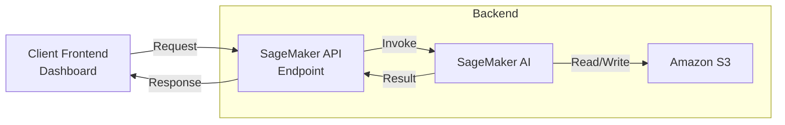

<!--
  README.md
-->

<p align="center">
  
</p>
<p align="center">
  <a href="#"></a>
  <a href="#"></a>
  <a href="#"></a>
  <a href="#"></a>
  <a href="#"></a>
  <a href="#"></a>
  <a href="#"></a>
  <a href="#"></a>
</p>

<p align="center">
  
  
</p>

# Predicting Student Attrition Through Housing Data

### Contributors: Jess Alencaster, Kenny Garcia, Viridiana Delgado, Mohith Kanthamneni, and Julianna Arias


A Sigmoid neuron–based predictive model built and trained on San Diego State University’s Office of Housing Administration Academic Year 2023–24 housing survey data to identify student attrition (i.e., students who are likely to leave, withdraw, or discontinue enrollment.) The system ingests housing-related inputs, computes individualized risk scores, and surfaces early-warning signals to enable proactive retention interventions (e.g., dashboards or alerts for housing/student support staff).


## Architecture



* Front end is React running on Next.js.  
* Amazon SageMaker AI hosts the model and provides an inference endpoint (trained via Jupyter notebook)
* Amazon S3 bucket contains OHA's datasets used for training and/or predictions.

## File Layout

```
.
├── .git/              # Git version control metadata
├── .gitignore         # Specifies files and folders Git should ignore
├── .next/             # Next.js build output (auto-generated)
├── node_modules/      # Installed dependencies (auto-generated)
├── public/            # Static assets (images, fonts, etc.)
├── src/               # Application source code (pages, components, styles, etc.)
├── package.json       # Project manifest (scripts, dependencies, metadata)
├── package-lock.json  # Lockfile to ensure exact dependency versions
├── tsconfig.json      # TypeScript configuration
├── next.config.ts     # Next.js configuration file
├── postcss.config.mjs # PostCSS setup (e.g., Tailwind CSS plugins)
├── eslint.config.mjs  # Linting rules and config
├── next-env.d.ts      # Auto-generated Next.js TypeScript types
├── README.md          # Project overview and setup instructions
```

## Deploy

1. Install Node.js 20 and Python 3.11.  
2. Configure AWS credentials in .env.local at the project root:: AWS_ACCESS_KEY_ID, AWS_SECRET_KEY, AWS_REGION, SAGEMAKER_ENDPOINT_NAME
3. Build and deploy backend

## Local Development

1. **Clone the repo:**

   ```bash
   git clone https://github.com/0x10jalencas/csu-summer-ai-camp-2025.git
   cd csu-summer-ai-camp-2025

2. **Create a `.env.local` file** at the root and add:

   ```env
   AWS_ACCESS_KEY_ID=your-access-key-id
   AWS_SECRET_ACCESS_KEY=your-secret-access-key
   AWS_REGION=your-region
   SAGEMAKER_ENDPOINT_NAME=your-endpoint-name

3. **Start the frontend:**
```bash
# Front end
npm install
npm run dev
```

## License

MIT License. See LICENSE file.
