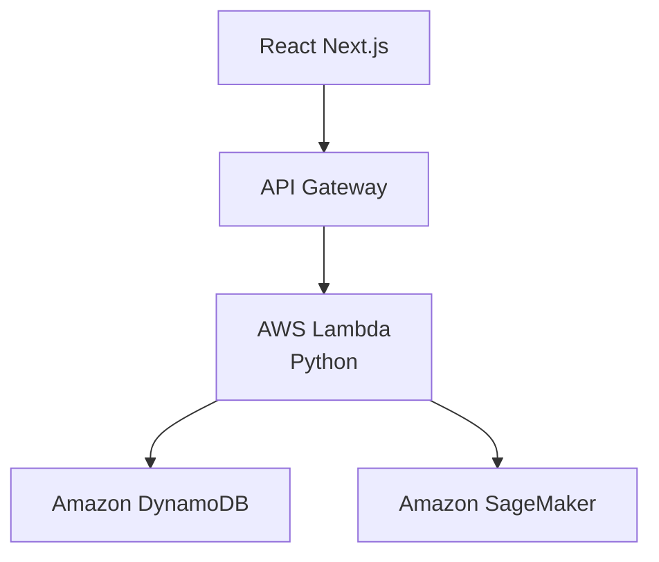

<!--
  README.md (simplified)
-->

<p align="center">
  
</p>

<p align="center">
  <a href="#"></a>
  <a href="#"></a>
  <a href="#"></a>
  <a href="#"></a>
  <a href="#"></a>
  <a href="#"></a>
  <a href="#"></a>
  <a href="#"></a>
  <a href="#"></a>
</p>

# Predicting Student Attrition Through Housing Data

An application that hosts an AI predictive model that identifies at-risk San Diego State University (SDSU) students through housing data.
Uses SDSU's Office of Housing Administration (OHA) Academic Year 23-24 survey datasets to train the AI predictive model.


## Architecture



* Front end is React running on Next.js.  
* Lambda serves JSON endpoints and calls SageMaker for predictions.  
* DynamoDB stores the OHA survey dataset.

## File Layout

```
.
├── .git/              # Git version control metadata
├── .gitignore         # Specifies files and folders Git should ignore
├── .next/             # Next.js build output (auto-generated)
├── node_modules/      # Installed dependencies (auto-generated)
├── public/            # Static assets (images, fonts, etc.)
├── src/               # Application source code (pages, components, styles, etc.)
├── package.json       # Project manifest (scripts, dependencies, metadata)
├── package-lock.json  # Lockfile to ensure exact dependency versions
├── tsconfig.json      # TypeScript configuration
├── next.config.ts     # Next.js configuration file
├── postcss.config.mjs # PostCSS setup (e.g., Tailwind CSS plugins)
├── eslint.config.mjs  # Linting rules and config
├── next-env.d.ts      # Auto-generated Next.js TypeScript types
├── README.md          # Project overview and setup instructions
```

## Deploy

1. Install Node.js 20 and Python 3.11.  
2. Configure AWS credentials.  
3. Build and deploy backend:

   ```bash
   cd infrastructure
   sam build
   sam deploy --guided        # or: cdk deploy
   ```

4. Deploy front end:

   ```bash
   cd web
   npm install
   npm run dev
   npm start
   ```

## Local Development

```bash
# Front end
cd web
npm run dev

# API
cd ../infrastructure
sam local start-api
```

## License

MIT License. See LICENSE file.
