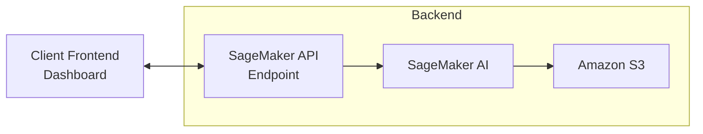
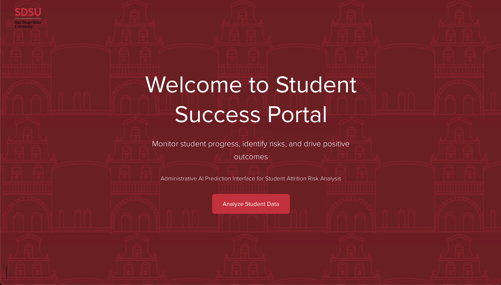
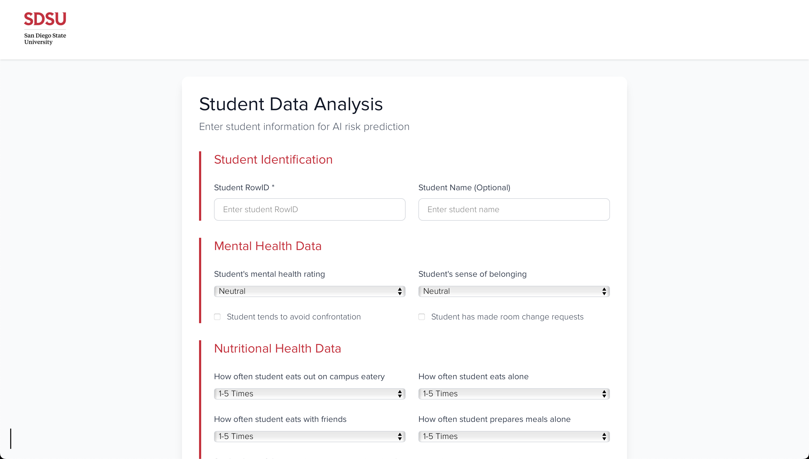
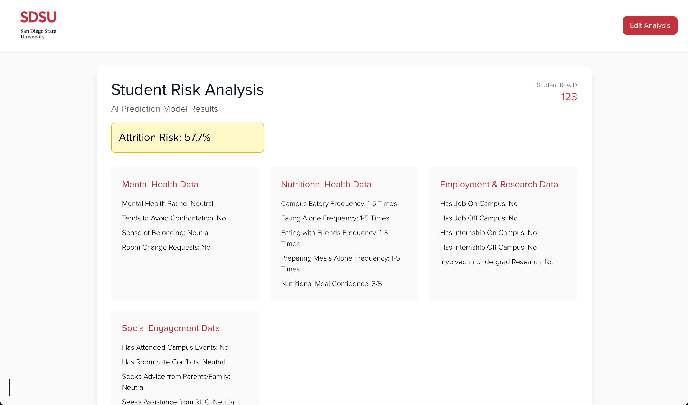
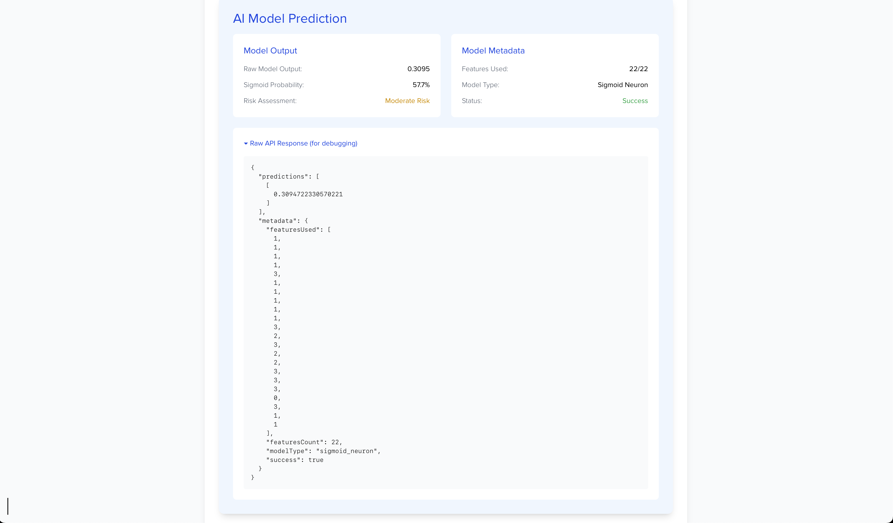

<!--
  README.md
-->

<p align="center">
  
</p>
<p align="center">
  <!-- Front-end -->
  <a href="#"></a>
  <a href="#"></a>
  <a href="#"></a>
  <a href="#"></a>
  <a href="#"></a>
  <a href="#"></a>
  <a href="#"></a>
  <a href="#"></a>
  <a href="#"></a>
  <a href="#"></a>
  <a href="#"></a>
</p>


<p align="center">
  
  
</p>

# Predicting Student Attrition Through Housing Data

### Contributors: Jess Alencaster, Kenny Garcia, Viridiana Delgado, Mohith Kanthamneni, and Julianna Arias


A Sigmoid neuron–based predictive model built and trained on San Diego State University’s Office of Housing Administration Academic Year 2023–24 housing survey data to identify student attrition (i.e., students who are likely to leave, withdraw, or discontinue enrollment.) The system ingests housing-related inputs, computes individualized risk scores, and surfaces early-warning signals to enable proactive retention interventions (e.g., dashboards or alerts for housing/student support staff).


## Architecture



* Front end is React running on Next.js.  
* Amazon SageMaker AI hosts the model and provides an inference endpoint (trained via Jupyter notebook)
* Amazon S3 bucket contains OHA's datasets used for training and/or predictions.

## File Layout

```
.
├── .git/                    # Git metadata (version control)
├── .gitignore               # create to ignores node_modules, venv, .env, etc.
├── README.md                # Project overview / instructions
├── package.json             # Root manifest (if used for tooling or workspaces)
├── package-lock.json        # Lockfile for JS dependencies
├── node_modules/            # JS dependencies (auto-generated)
├── shared/                  # Shared code / utilities
├── frontend/                # Next.js + TypeScript app
│   ├── eslint.config.mjs
│   ├── next-env.d.ts
│   ├── next.config.ts
│   ├── postcss.config.mjs
│   ├── tsconfig.json
│   ├── package.json
│   ├── node_modules/        # frontend-specific deps (could be deduped)
│   ├── public/              # Static assets
│   └── src/                 # Application source (pages, components, etc.)
└── backend/                 # Python / ML inference & deployment
    ├── bundle/
    ├── data/
    ├── deploy_to_sagemaker.py
    ├── ml/
    ├── model/
    ├── requirements.txt
    ├── simple_inference/
    ├── simple_model.py
    ├── test_simple_inference.py
    └── venv/               # Python virtual environment (should be gitignored)


```

## Prerequisites

1. Install Node.js 20 and Python 3.9+.  
2. Configure AWS credentials in .env.local at the project root: AWS_ACCESS_KEY_ID, AWS_SECRET_KEY, AWS_REGION, SAGEMAKER_ENDPOINT_NAME
3. Configure an Amazon Sagemaker AI endpoint (via Jupyter Notebook or deploy_to_sagemaker.py)
4. Email [jalencas@calpoly.edu](mailto:jalencas@calpoly.edu) for the cleaned .csv file to put into an Amazon S3 bucket.

## Local Development

1. **Clone the repo:**

   ```bash
   git clone https://github.com/0x10jalencas/csu-summer-ai-camp-2025.git
   cd csu-summer-ai-camp-2025

2. **Create a `.env.local` file** at the root and add:

   ```env
   AWS_ACCESS_KEY_ID=your-access-key-id
   AWS_SECRET_ACCESS_KEY=your-secret-access-key
   AWS_REGION=your-region
   SAGEMAKER_ENDPOINT_NAME=your-endpoint-name

3. **Start the frontend:**
```bash
# Front end
cd frontend
npm install
npm run dev
```

4. **Start the backend:**
```bash
# Backend
cd backend
python -m venv venv
source venv/bin/activate
pip install -r requirements.txt
python simple_model.py
npm install
npm run dev
```
## Screenshots

|              Home              |              Student Form              |       Risk Analysis Dashboard       |         Model Output & Raw JSON        |
|:-----------------------------:|:--------------------------------------:|:-----------------------------------:|:--------------------------------------:|
|  |           |  |          |

## Model Development

### 1.  Data pipeline

| Stage | Tooling | What happens |
|-------|---------|--------------|
| **Raw CSV to Notebook** | Jupyter (Python 3.11) | Import AY 23-24 OHA survey responses. |
| **Cleaning** | `pandas` | Filter for 23 columns (referred to as features), and drop <25% of empty respondent information, impute the rest with mode (categorical) or median (numeric). |
| **Feature engineering** | `sklearn.preprocessing` | *Ordinal* answers scaled to \[0, 1\]; *categorical* answers one-hot encoded. |
| **Vector assembly** | custom | Each row ➜ **22-D NumPy vector** preserved as `float32`. |
| **Artifact storage** | Amazon S3 | Cleaned feature matrix (`cleaned_22d.csv`) + label column (`attrition=1/0`). |

### 2.  Why a single sigmoid neuron?

Because we are answering the binary question (yes/no) of whether or not a student has left SDSU housing or not, a single sigmoid neuron cleanly outputs a probability in [0,1] that maps directly to that outcome. Its tiny parameter footprint further minimizes over-fitting and keeps real-time inference costs negligible as well.

| Requirement | How the sigmoid model meets it |
|-------------|--------------------------------|
| **Interpretability** – housing staff need to see *why* a student is flagged. | Each weight `w_i` directly reflects the contribution of feature *i*. This allows for scalability.|
| **Small-ish dataset** – one academic year of survey data. | A shallow model avoids overfitting and trains in seconds. |
| **Low-latency inference (dashboard clicks)** | Forward pass is just a dot-product and a `σ`; < 1 ms on t3.large. |

Alternative models we tried:

| Model | F1-score | Notes |
|-------|---------:|-------|
| Logistic Regression | 0.84 | Similar math, but a bit less stable on rare categories. |
| Random Forest | 0.82 | Better on noisy features but slower on opaque feature importances. |
| **Sigmoid Neuron** | **0.86** | Highest F1 with the simplest deploy. |


### 3. Mathematical formulation

The model is a one-layer neural network with a sigmoid activation:

$$
\hat{y} = \sigma(W \cdot X + b), \qquad 
\sigma(z) = \frac{1}{1 + e^{-z}}
$$

* Standardized feature vector: $$X \in \mathbb{R}^{22}$$
* Learnable weight vector: $$W \in \mathbb{R}^{22}$$
* Bias term: $$b \in \mathbb{R}$$
* Attrition probability: $$\hat{y} \in (0,1)$$

The loss we minimize is the binary cross-entropy:

$$
\mathcal{L}(y, \hat{y}) = -\left( y \log \hat{y} + (1 - y)\log(1 - \hat{y}) \right)
$$

Training is done with mini-batch gradient descent using `sklearn.linear_model.SGDClassifier` with `loss="log_loss"`.

### 4.  Training & evaluation

```bash
# Reproduce locally
cd backend/ml
python train_sigmoid.py --csv s3://.../cleaned_22d.csv
```

## License

MIT License. See LICENSE file.
